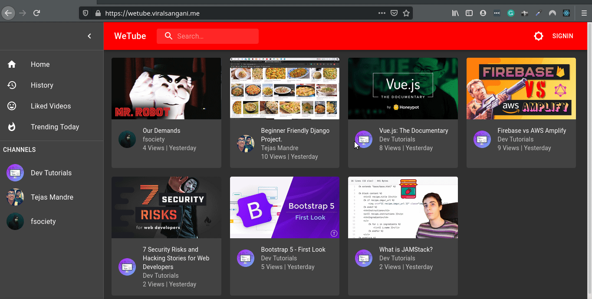

    
     
     
    

🎞 📺 Just a Clone of Youtube, made with ReactJS and Django APIs.💥

    Project URL - <a href="https://wetube.viralsangani.me/">https://wetube.viralsangani.me/</a>

## DEMO

## :raised_hands: Technology Stack

### :floppy_disk: Hosted Using

-   **AWS S3** - Static Hosting
-   **AWS Cloudfront** - CDN Service
-   **AWS Lamdba** - Serverless function for REST APIs
-   **AWS API Gateway** - Hosting Django APIs
-   **AWS Route53** - Sub-Domain Configuration

### :key: APIs

Created my own APIs using django which can be found here - [https://github.com/viral-sangani/WeTube-Backend](https://github.com/viral-sangani/WeTube-Backend)

## 🚀 Get Up and Running in 5 Minutes

### Prerequisites

-   [node](https://nodejs.org/en/) >= 12.16.2
-   [npm](https://www.npmjs.com/) >= 6.14.4

### :running: Steps

1. Clone/Download [this](https://github.com/viral-sangani/gatsby-blog) repository.
2. Inside the project open a terminal and run `npm i --save`.
3. To start the project, run `gatsby develop`.

### 💜 Thanks

Special thanks to [@tanaypratap](https://github.com/tanaypratap) sir, and [2020.teamtanay.jobchallenge.dev](https://github.com/tanaypratap/teamtanay.jobchallenge.dev) for encouraging student like me to create amazing projects and help us to grow.
